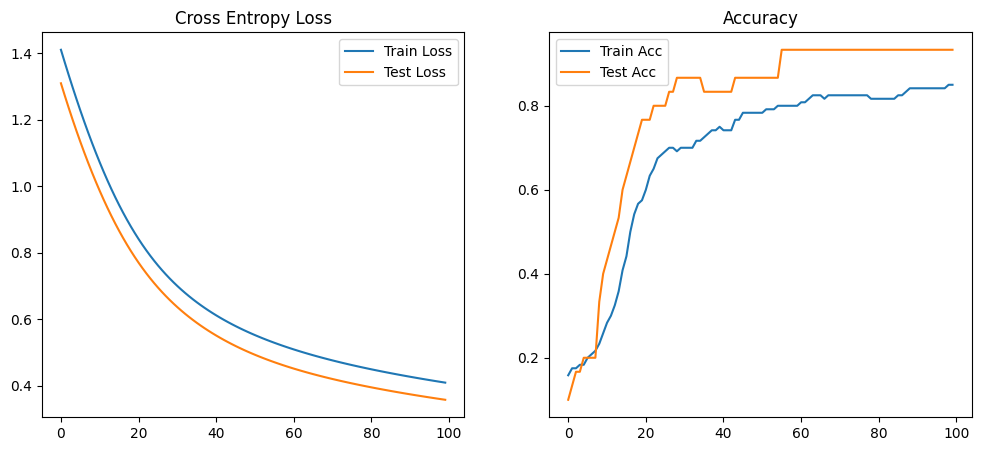

# Iris分类项目 - PyTorch实现

## 项目目标
使用PyTorch实现鸢尾花(Iris)数据集的分类任务，比较不同优化器、学习率和训练轮次的模型表现。

## 模型架构
- 单层神经网络
- 输入层: 4个特征(花萼长度、花萼宽度、花瓣长度、花瓣宽度)
- 输出层: 3个类别(setosa, versicolor, virginica)
- 激活函数: Softmax

## 训练过程
1. 数据预处理: 标准化特征值
2. 损失函数: 交叉熵损失
3. 优化器比较: SGD, Adam, RMSprop
4. 超参数调优:
   - 学习率: 0.001, 0.01, 0.1
   - 训练轮次: 50, 100, 200

## 实验结果
通过可视化对比不同超参数组合下的模型表现:
1. 测试准确率
2. 测试损失
3. 训练时间

最佳参数组合:
- 优化器: [根据实际结果填写]
- 学习率: [根据实际结果填写]
- 训练轮次: [根据实际结果填写]

## 文件说明
- `iris_single_layer_nn.ipynb`: 基础单层神经网络实现
- `iris_torch_tuning_visual.ipynb`: 超参数调优与可视化

## 运行要求
- Python 3.x
- PyTorch
- matplotlib
- pandas
- scikit-learn